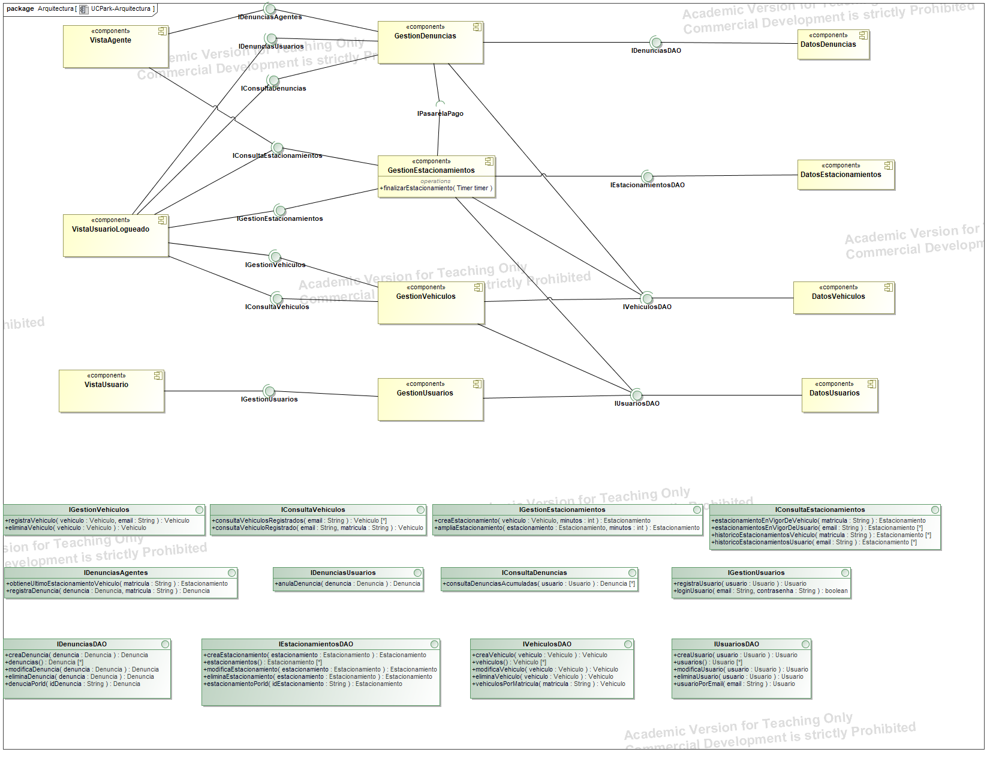

# UCPark
Repositorio que contiene la implementación de la aplicación UCPark, correspondiente a la "Práctica 3" de Procesos de Ingeniería del Software.

Diagrama de la arquitectura multicapa del sistema.

------------------------------------------

Diagrama de clases del dominio del sistema

